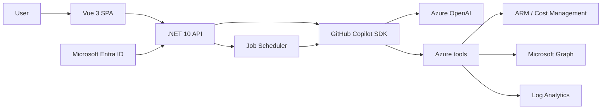

# Azure FinOps Agent

[](LICENSE)
[](https://github.com/Azure-Samples/azure-finops-agent/releases/latest)
[](https://dotnet.microsoft.com)
[](https://vuejs.org)

**Turn Azure cost, governance, and optimization work into a conversation.**

Azure FinOps Agent analyzes live Azure data, scores FinOps maturity, finds savings, creates charts and executive decks, and generates reviewable remediation scripts. It is read-only: it reads with the signed-in user's delegated permissions and cannot create, update, or delete Azure resources — changes are delivered as scripts you review and run.

[Try the hosted demo](https://azure-finops-agent.com) · [View the presentation](https://azure-finops-agent.com/slides)


## Capabilities

- Live cost, budget, Advisor, Resource Graph, reservation, and savings-plan analysis
- Crawl / Walk / Run FinOps maturity scoring with evidence
- Microsoft Graph, Log Analytics, and Cost Export integrations through incremental consent
- Public Azure pricing and service-health questions without signing in
- CSV, TSV, JSON, XLSX, PDF, Parquet, and image analysis
- Scheduled background jobs with durable run history
- Charts, HTML presentations, and reviewable Azure CLI or PowerShell scripts

## Architecture



The app runs as a Linux container on Azure App Service. Azure Developer CLI provisions Azure Container Registry, Azure OpenAI, monitoring, managed identities, RBAC, App Service, and the optional Entra application.

## Deploy to your Azure subscription

### Prerequisites

- [Azure CLI](https://learn.microsoft.com/cli/azure/install-azure-cli)
- [Azure Developer CLI](https://learn.microsoft.com/azure/developer/azure-developer-cli/install-azd)
- An Azure subscription where you can create resources and role assignments
- Permission to create an Entra app registration, or an existing app registration to reuse

### Deploy

```powershell
az login --tenant <tenant-id>
az account set --subscription <subscription-id>
azd auth login
azd up
```

`azd up` prompts for an environment and region, provisions the stack, builds the image in ACR, and prints the application URL. To reuse existing resources or change defaults, use `azd env set`; see [Azure deployment permissions](docs/azd-up-permissions.md) and [azure.yaml](azure.yaml).

Remove the deployment with:

```powershell
azd down --purge
```

## Try without Azure access

- Ask a public pricing or Azure service-health question.
- Upload a sample from [demo-data](demo-data/README.md).

## Run locally

### Prerequisites

- [.NET 10 SDK](https://dotnet.microsoft.com/download/dotnet/10.0)
- [Node.js 22+](https://nodejs.org/)
- Azure CLI authenticated to the tenant containing your Azure OpenAI resource

### Configure

```powershell
cd src/Dashboard
dotnet user-secrets set "AzureOpenAI:Endpoint" "https://<your-resource>.openai.azure.com/"
dotnet user-secrets set "AzureOpenAI:DeploymentName" "<your-deployment>"
```

Optional settings:

- `AzureOpenAI:TenantId` when the model resource is in a different tenant from the Azure CLI default
- `Microsoft:ClientId`, `Microsoft:ClientSecret`, and `Microsoft:TenantId` to enable Azure sign-in locally
- `ApplicationInsights:ConnectionString` for telemetry

### Build and run

```powershell
cd src/Dashboard/frontend
npm ci
npm run build

cd ..
$env:ASPNETCORE_ENVIRONMENT = "Development"
dotnet run --urls http://localhost:5000
```

Open [http://localhost:5000](http://localhost:5000).

## Security

- OAuth uses PKCE, nonce validation, incremental delegated consent, and explicit resource scopes.
- Azure and Microsoft Graph writes — `PUT`, `PATCH`, `DELETE`, and mutating action `POST` — are refused in code before any request is sent. `POST` is limited to an allowlist of read-only query and report endpoints.
- The user's Azure RBAC and consented scopes are a second boundary, not the only one. For a hard guarantee that is independent of this application, connect an account holding only Reader / Cost Management Reader.
- Generated downloads and session transcripts are ownership-checked.
- Production secrets belong in managed identities, App Service settings, or GitHub Actions secrets—not in source control.

See [SECURITY.md](SECURITY.md) for reporting vulnerabilities and [docs/session-management.md](docs/session-management.md) for session behavior.

## Contributing

See [CONTRIBUTING.md](CONTRIBUTING.md), [SUPPORT.md](SUPPORT.md), and the [Code of Conduct](CODE_OF_CONDUCT.md).

## License

[MIT](LICENSE)
